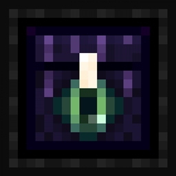

# ndrchst



A modded-Minecraft stack that runs on one box: the control plane that creates
and runs the servers, the desktop client players launch from, and the
Cloudflare edge that distributes it. MIT licensed.

Most Minecraft "panels" stop at start / stop / console. ndrchst is the whole
vertical in one repo — run the server, build a per-server client, and ship that
client (with its modpack) to players from a CDN, with the game connection
wrapped in a Cloudflare tunnel so the host IP stays hidden.

## What's in here

- **Control plane** — `src/ndrchst/`, FastAPI + htmx + SQLite on `:8080`.
  Create and run Java + Bedrock servers in Docker, install mods/plugins/packs
  from Modrinth, RCON console, backups, properties editor. Localhost-first.
- **Desktop client** — `client/`, a launcher over portablemc. Modpack + mod sync
  straight from the server (the operator's curated set is authoritative), the
  game connection wrapped in a Cloudflare tunnel, and self-update with SHA-256
  verification. Launches in **offline mode** (a username) by default, or with a
  **Microsoft account** for online-mode / vanilla servers.
- **Edge** — `cf/worker/`. A Cloudflare Worker serving per-server client
  artifacts and the server catalog from R2, fully static.

## Design choices worth knowing

- **One source of truth, derived not copied.** A server's mod set lives on the
  box; the client mirrors `mods/index.json` exactly rather than re-resolving from
  an upstream manifest, so the operator's curated set is what players run.
- **Two exposure models.** The admin plane (`:8080`) is meant for a private
  network only (e.g. Tailscale). The only thing the internet reaches is the
  static edge — client downloads + the server list, served from R2.
- **The box stays off the hot path.** Once published, clients pull config,
  manifest, the mod index, and `client.zip` from Cloudflare's edge; the box only
  does the one-time outbound upload per change.

## Quickstart (control plane)

```bash
uv sync
uv run ndrchst run      # uvicorn on http://localhost:8080
uv run ndrchst doctor   # env preflight: Docker, ports, disk, group
```

Open <http://localhost:8080>, create a Paper or NeoForge server, install a mod.

Wiring up client distribution (the edge Worker, R2, per-server client builds) is
a deployment, not a `pip install`. See [deploy/OPS.md](deploy/OPS.md) for how the
hosted stack fits together.

## Requirements

- Linux (macOS soon, Windows via WSL)
- Docker
- Python 3.12+

## Layout

```
src/ndrchst/
  platforms/   per-platform install + version logic (Paper, NeoForge, Bedrock, Modpack, …)
  mods/        Modrinth asset source (search + version listing)
  runtime/     Docker, RCON, lifecycle, client-bundle build, R2/edge publish
  domain/      players, worlds, files, properties
  store/       SQLite (no ORM) — servers, installed assets
  api/         admin JSON API + app factory (:8080)
  web/         htmx admin UI
  cli.py       `ndrchst run` / `ndrchst doctor`
client/        the desktop launcher (PyInstaller-packaged)
cf/worker/     the Cloudflare edge Worker (static R2 distribution)
deploy/        deployment guide + systemd units
```

See [docs/architecture.md](docs/architecture.md) for how a server, a client
build, and a launch flow through it.

## Status

Alpha, single-operator by design — there's no multi-user/RBAC, because the admin
plane is meant to sit behind a private network, not face the world. Roughly 6k
LOC Python (plus a ~3k-LOC client) and ~300 tests.

## License

MIT — see [LICENSE](LICENSE). Security posture and what's deliberately kept out
of the repo: [SECURITY.md](SECURITY.md).
